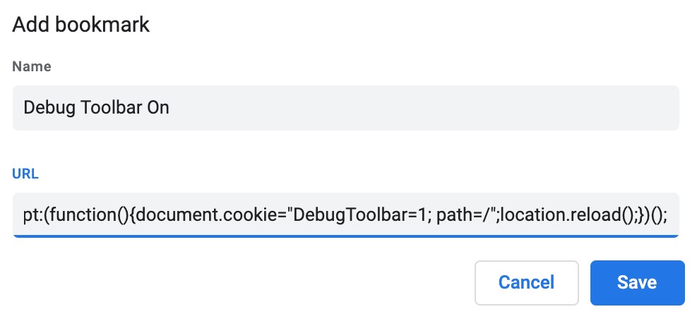
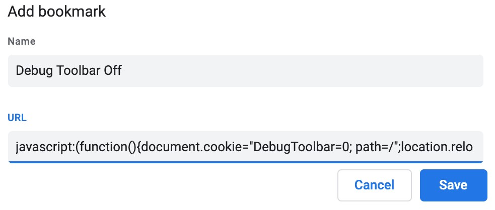
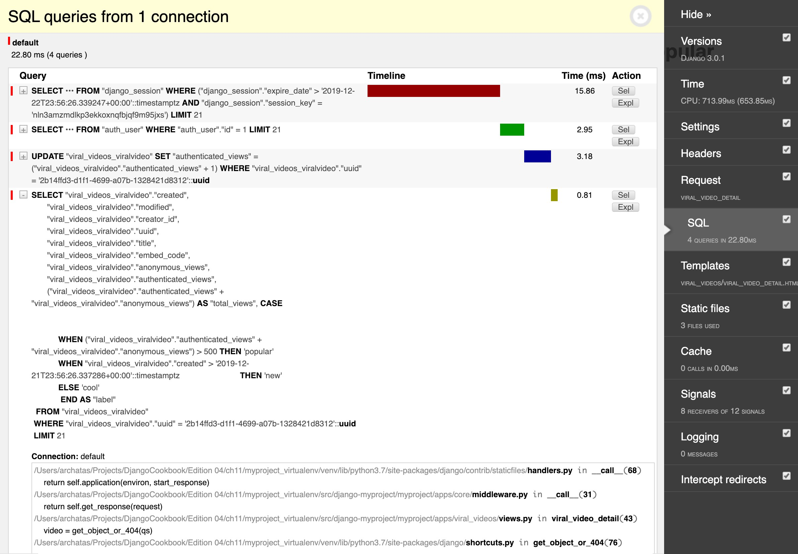
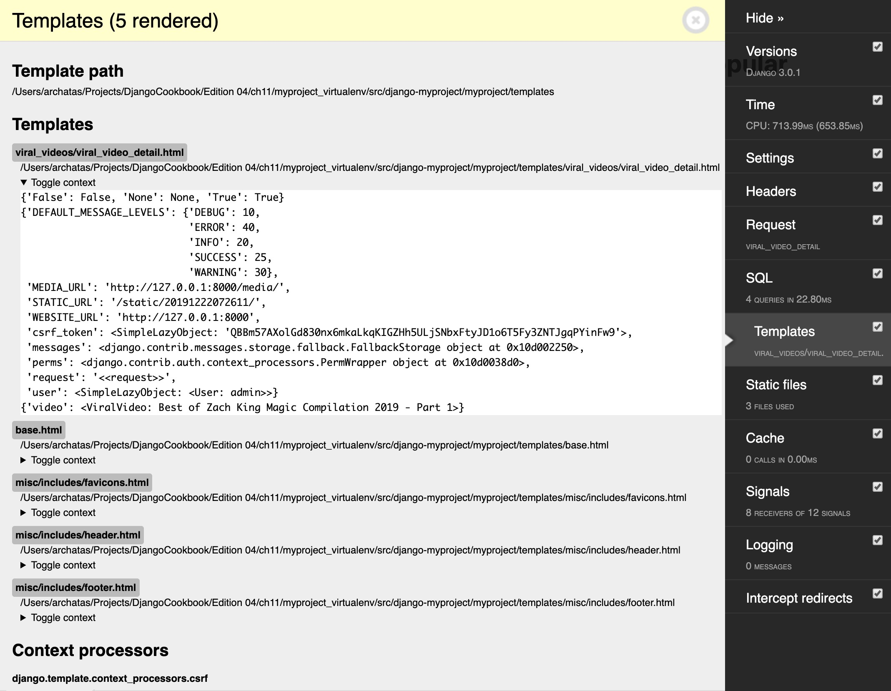

# 10.4 Переключение панели Debug

При разработке с помощью Django вы можете проверить заголовки и параметры запроса, проверить текущий контекст шаблона или измерить производительность SQL-запросов. Все это и многое другое возможно с помощью панели инструментов **Django Debug Toolbar**. Это настраиваемый набор панелей, отображающих различную отладочную информацию о текущем запросе и ответе. В этом рецепте мы расскажем вам, как переключать видимость панели инструментов отладки в зависимости от файла **cookie**, значение которого может быть установлено букмарклетом. Букмарклет — это закладка с небольшим фрагментом кода **JavaScript**, которую вы можете запустить на любой странице в браузере.

## Подготовка

Чтобы начать работу с переключением видимости панели инструментов отладки, выполните следующие действия:

1. Установите панель инструментов отладки **Django Debug Toolbar** в вашей виртуальной среде:

```bash
(env)$ pip install django-debug-toolbar==2.1
```

2\. Добавьте `«debug_toolbar»` в **INSTALLED\_APPS** в настройках:

```python
# myproject/settings/_base.py
INSTALLED_APPS = [
    # …
    "debug_toolbar",
]
```

## Как это сделать...

Выполните следующие действия, чтобы настроить панель инструментов отладки Django Debug Toolbar, которую можно включить или отключить с помощью закладки в браузере:

1. Добавьте следующие настройки проекта:

<pre class="language-python"><code class="lang-python"># myproject/settings/_base.py
DEBUG_TOOLBAR_CONFIG = {
<strong>    "DISABLE_PANELS": [],
</strong>    "SHOW_TOOLBAR_CALLBACK":
    "myproject.apps.core.misc.custom_show_toolbar",
    "SHOW_TEMPLATE_CONTEXT": True,
}

DEBUG_TOOLBAR_PANELS = [
    "debug_toolbar.panels.versions.VersionsPanel",
    "debug_toolbar.panels.timer.TimerPanel",
    "debug_toolbar.panels.settings.SettingsPanel",
    "debug_toolbar.panels.headers.HeadersPanel",
    "debug_toolbar.panels.request.RequestPanel",
    "debug_toolbar.panels.sql.SQLPanel",
    "debug_toolbar.panels.templates.TemplatesPanel",
    "debug_toolbar.panels.staticfiles.StaticFilesPanel",
    "debug_toolbar.panels.cache.CachePanel",
    "debug_toolbar.panels.signals.SignalsPanel",
    "debug_toolbar.panels.logging.LoggingPanel",
    "debug_toolbar.panels.redirects.RedirectsPanel",
]
</code></pre>

2\. В приложении **core** создайте файл **misc.py** с функцией `custom_show_toolbar()` следующим образом:

```python
# myproject/apps/core/misc.py
def custom_show_toolbar(request):
    return "1" == request.COOKIES.get("DebugToolbar", False)
```

3\. В **urls.py** проекта добавьте следующие правила конфигурации:

```python
# myproject/urls.py
from django.conf.urls.i18n import i18n_patterns
from django.urls import include, path
from django.conf import settings
import debug_toolbar

urlpatterns = i18n_patterns(
    # …
)

urlpatterns = [
    path('__debug__/', include(debug_toolbar.urls)),
] + urlpatterns
```

4\. Откройте браузер Chrome или Firefox и перейдите в менеджер закладок. Затем создайте две новые закладки, содержащие **JavaScript**. Первая ссылка покажет панель инструментов и будет выглядеть следующим образом:

<figure><figcaption></figcaption></figure>

Код **JavaScript** выглядит следующим образом:

```javascript
javascript:(function(){document.cookie="DebugToolbar=1;path=/";location.reload();})();
```

5\. Вторая ссылка **JavaScript** скроет панель инструментов и будет выглядеть примерно так:

<figure><figcaption></figcaption></figure>

Это полный код **JavaScript**:

```javascript
javascript:(function(){document.cookie="DebugToolbar=0;path=/";location.reload();})();
```

## Как это работает...

Параметр **DEBUG\_TOOLBAR\_PANELS** определяет панели, которые будут отображаться на панели инструментов. Словарь **DEBUG\_TOOLBAR\_CONFIG** определяет конфигурацию панели инструментов, включая путь к функции, используемой для проверки, показывать ли панель инструментов.

По умолчанию, когда вы просматриваете свой проект, панель инструментов **Django Debug Toolbar** не отображается; однако, когда вы нажмете на свой букмарклет, панель инструментов отладки включена, cookie-файл **DebugToolbar** будет установлен на `1`, страница будет обновлена, и вы увидите панель инструментов с панелями отладки — например, вы сможете проверить производительность Операторы SQL для оптимизации, как показано на следующем снимке экрана:

<figure><figcaption></figcaption></figure>

Вы также сможете проверить переменные контекста шаблона для текущего представления, как показано на следующем снимке экрана:

<figure><figcaption></figcaption></figure>

Щелчок по второй закладке, **Debug Toolbar Off**, аналогичным образом установит для файла cookie **DebugToolbar** значение `0` и обновит страницу, снова скрыв панель инструментов.

## Смотрите также

* Рецепт "Получения подробных отчетов об ошибках по электронной почте" в Главе 13, "Обслуживание"
