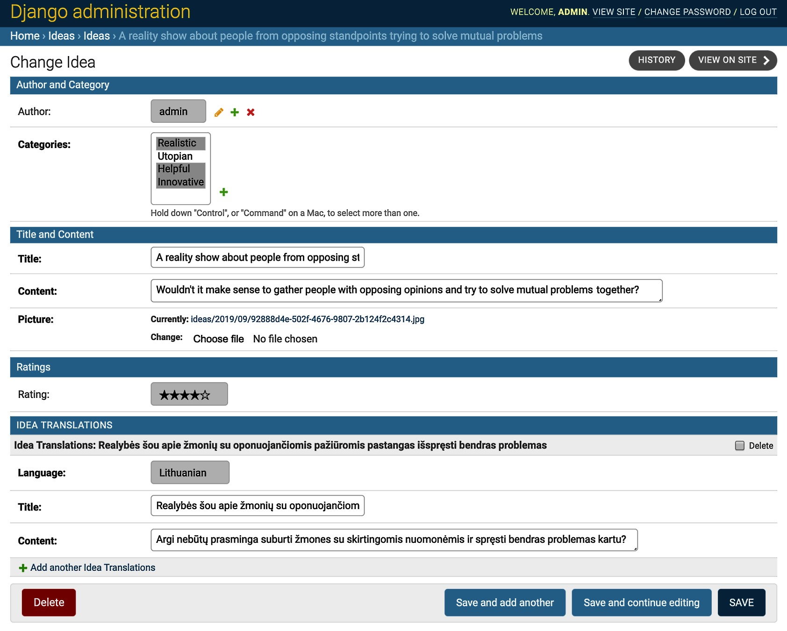
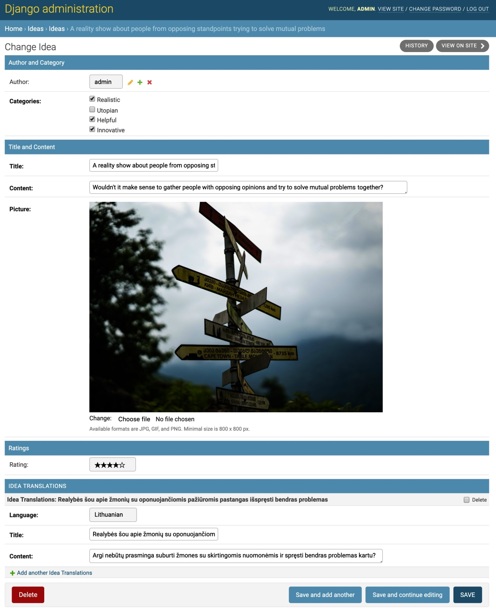

# 3.4 Создание макета формы с помощью пользовательских шаблонов

В более ранних версиях Django весь рендеринг форм обрабатывался исключительно в коде Python, но начиная с **Django 1.11** был введен рендеринг виджетов форм на основе шаблонов. В этом рецепте мы рассмотрим, как использовать пользовательские шаблоны для виджетов форм. Мы собираемся использовать форму администрирования Django, чтобы проиллюстрировать, как пользовательские шаблоны виджетов могут улучшить удобство использования полей.

## Порядок

Давайте создадим администрирование Django по умолчанию для модели **Idea** и ее переводов:

```python
# myproject/apps/ideas/admin.py
from django import forms
from django.contrib import admin
from django.utils.translation import gettext_lazy as _

from myproject.apps.core.admin import LanguageChoicesForm

from .models import Idea, IdeaTranslations

class IdeaTranslationsForm(LanguageChoicesForm):
    class Meta:
        model = IdeaTranslations
        fields = "__all__"

class IdeaTranslationsInline(admin.StackedInline):
    form = IdeaTranslationsForm
    model = IdeaTranslations
    extra = 0

@admin.register(Idea)
class IdeaAdmin(admin.ModelAdmin):
    inlines = [IdeaTranslationsInline]
    fieldsets = [
        (_("Author and Category"), {"fields": ["author", "categories"]}),
        (_("Title and Content"), {"fields": ["title", "content", "picture"]}),
        (_("Ratings"), {"fields": ["rating"]}),
    ]
```

Если вы откроете форму администрирования идей, она будет выглядеть так:

<figure><figcaption></figcaption></figure>

## Как это сделать...

Чтобы завершить рецепт, выполните следующие действия:

1. Убедитесь, что система шаблонов сможет находить настраиваемые шаблоны, добавив `«django.forms»` в **INSTALLED\_APPS**, включив флаг **APP\_DIRS** в значение `True` в конфигурации шаблонов и используя средство визуализации формы `«TemplatesSetting»`:

<pre class="language-python"><code class="lang-python"># myproject/settings/_base.py
INSTALLED_APPS = [
<strong>    "django.contrib.admin",
</strong>    "django.contrib.auth",
    "django.contrib.contenttypes",
    "django.contrib.sessions",
    "django.contrib.messages",
    "django.contrib.staticfiles",
    "django.forms",
    # другие приложения…
]

TEMPLATES = [
    {
        "BACKEND": "django.template.backends.django.DjangoTemplates",
        "DIRS": [os.path.join(BASE_DIR, "myproject", "templates")],
        "APP_DIRS": True,
        "OPTIONS": {
            "context_processors": [
                "django.template.context_processors.debug",
                "django.template.context_processors.request",
                "django.contrib.auth.context_processors.auth",
                "django.contrib.messages.context_processors.messages",
                "django.template.context_processors.media",
                "django.template.context_processors.static",
                "myproject.apps.core.context_processors.website_url",
            ]
        },
    }
]

FORM_RENDERER = "django.forms.renderers.TemplatesSetting"
</code></pre>

2\. Отредактируйте файл **admin.py** следующим образом:

```python
# myproject/apps/ideas/admin.py
from django import forms
from django.contrib import admin
from django.utils.translation import gettext_lazy as _

from myproject.apps.core.admin import LanguageChoicesForm

from myproject.apps.categories.models import Category
from .models import Idea, IdeaTranslations

class IdeaTranslationsForm(LanguageChoicesForm):
    class Meta:
        model = IdeaTranslations
        fields = "__all__"

class IdeaTranslationsInline(admin.StackedInline):
    form = IdeaTranslationsForm
    model = IdeaTranslations
    extra = 0

class IdeaForm(forms.ModelForm):
    categories = forms.ModelMultipleChoiceField(
        label=_("Categories"),
        queryset=Category.objects.all(),
        widget=forms.CheckboxSelectMultiple(),
        required=True,
    )

    class Meta:
        model = Idea
        fields = "__all__"

    def __init__(self, *args, **kwargs):
        super().__init__(*args, **kwargs)
        self.fields["picture"].widget.template_name = "core/widgets/image.html"

@admin.register(Idea)
class IdeaAdmin(admin.ModelAdmin):
    form = IdeaForm
    inlines = [IdeaTranslationsInline]

    fieldsets = [
        (_("Author and Category"), {"fields": ["author", "categories"]}),
        (_("Title and Content"), {"fields": ["title", "content", "picture"]}),
        (_("Ratings"), {"fields": ["rating"]}),
    ]
```

3\. Наконец, создайте шаблон для поля изображения:

```django
{# core/widgets/image.html #}



<div style="margin-left: 160px; padding-left: 10px;">
    
        <a href="{{ widget.value.url }}">
            
        </a>
        <br />
            {{ widget.clear_checkbox_label }}:
            <input type="checkbox" name="{{ widget.checkbox_name }}"
                   id="{{ widget.checkbox_id }}">
        <br />
        {{ widget.input_text }}:
    
    <input type="{{ widget.type }}" name="{{ widget.name }}"
        >
</div>

<div class="help">
    
    

</div>
```

## Как это работает...

Если вы сейчас посмотрите на форму администрирования идей, то увидите что-то вроде этого:

<figure><figcaption></figcaption></figure>

Здесь есть два изменения:

* Выбор категории теперь использует виджет с несколькими флажками.
* Поле изображения теперь отображается с использованием определенного шаблона, показывая предварительный просмотр изображения и текст справки с предпочтительными типами файлов и размерами.

Что мы сделали здесь, так это перезаписали форму модели для идеи и изменили виджет для категорий и шаблон для поля изображения.


**ВАЖНО**

Средство визуализации форм по умолчанию в Django — `«django.forms.renderers.DjangoTemplates»`, и оно ищет шаблоны **только** в каталогах приложений. Мы изменили его на `«django.forms.renderers.TemplatesSetting»`, чтобы также просмотреть шаблоны в путях **DIRS**.


## Смотрите также

* Рецепт «[Работа с таблицами преобразования модели](../2.-modeli-i-struktury-bd/2.7-rabota-s-tablicami-perevoda-modeli.md)» в главе 2 «[Модели и структура базы данных](../2.-modeli-i-struktury-bd/)»
* Рецепт [загрузки изображений](3.3-zagruzka-izobrazhenii.md)
* Рецепт [Создание макета формы с помощью django-crispy-forms](3.5-sozdanie-maketa-formy-s-pomoshyu-django-crispy-forms.md)
