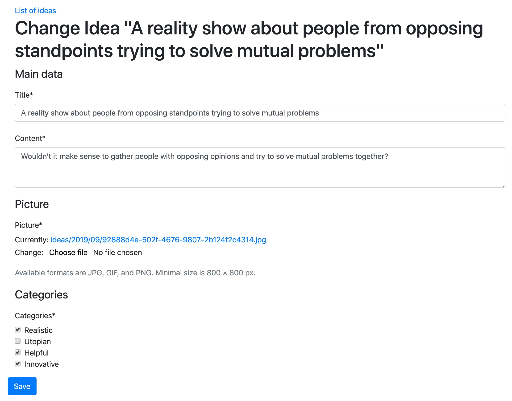

# 3.5 Создание макета формы с помощью django-crispy-forms

Приложение **django-crispy-forms** Django позволяет создавать, настраивать и повторно использовать формы с помощью одной из следующих платформ **CSS**: **Uni-Form**, **Bootstrap 3**, **Bootstrap 4** или **Foundation**. Использование **django-crispy-forms** чем-то похоже на наборы полей в администрировании Django; однако он более продвинутый и настраиваемый. Вы определяете макет формы в коде Python, и вам не нужно беспокоиться о том, как каждое поле представлено в HTML. Более того, если вам нужно добавить определенные атрибуты HTML или обертку, вы также можете легко это сделать. Вся разметка, используемая **django-crispy-forms**, находится в шаблонах, которые можно перезаписывать для конкретных нужд.

В этом рецепте мы создадим красивый макет для формы внешнего интерфейса, чтобы добавлять или редактировать идеи, используя **Bootstrap 4**, популярный фреймворк внешнего интерфейса для разработки адаптивных мобильных веб-проектов.

## Подготовка

Мы начнем с приложения **ideas**, которое мы создали в этой главе. Далее мы выполним следующие задачи одну за другой:

1. Убедитесь, что вы создали шаблон `base.html` для своего сайта. Узнайте больше об этом в рецепте _Упорядочение шаблона base.html_ в Главе 4, _Шаблоны и JavaScript_.
2. Интегрируйте CSS- и JS-файлы фреймворка **Bootstrap 4** из [https://getbootstrap.com/docs/4.3/getting-start/introduction/](https://getbootstrap.com/docs/4.3/getting-started/introduction/) в шаблон `base.html`.
3. Установите **django-crispy-forms** в вашей виртуальной среде с помощью **pip** (и включите его в `requirements/_base.txt`):

```bash
(env)$ pip install django-crispy-forms
```

4\. Убедитесь, что в **INSTALLED\_APPS** в настройках добавлено `«crispy_forms»`, а затем установите `«bootstrap4»` в качестве пакета шаблонов, который будет использоваться в этом проекте:

```python
# myproject/settings/_base.py
INSTALLED_APPS = (
    # ...
    "crispy_forms",
    "ideas",
)
# ...
CRISPY_TEMPLATE_PACK = "bootstrap4"
```

## Как это сделать...

Следуй этим шагам:

1. Давайте изменим форму модели для идей:

```python
# myproject/apps/ideas/forms.py
from django import forms
from django.utils.translation import ugettext_lazy as _
from django.conf import settings
from django.db import models

from crispy_forms import bootstrap, helper, layout

from .models import Idea

class IdeaForm(forms.ModelForm):
    class Meta:
        model = Idea
        exclude = ["author"]

    def __init__(self, request, *args, **kwargs):
        self.request = request
        super().__init__(*args, **kwargs)

        self.fields["categories"].widget = forms.CheckboxSelectMultiple()

        title_field = layout.Field(
            "title", css_class="input-block-level"
        )
        content_field = layout.Field(
            "content", css_class="input-block-level", rows="3"
        )
        main_fieldset = layout.Fieldset(
            _("Main data"), title_field, content_field
        )

        picture_field = layout.Field(
            "picture", css_class="input-block-level"
        )
        format_html = layout.HTML(
            """

"""
        )

        picture_fieldset = layout.Fieldset(
            _("Picture"),
            picture_field,
            format_html,
            title=_("Image upload"),
            css_id="picture_fieldset",
        )

        categories_field = layout.Field(
            "categories", css_class="input-block-level"
        )
        categories_fieldset = layout.Fieldset(
            _("Categories"), categories_field,
            css_id="categories_fieldset"
        )

        submit_button = layout.Submit("save", _("Save"))
        actions = bootstrap.FormActions(submit_button)

        self.helper = helper.FormHelper()
        self.helper.form_action = self.request.path
        self.helper.form_method = "POST"
        self.helper.layout = layout.Layout(
            main_fieldset,
            picture_fieldset,
            categories_fieldset,
            actions,
        )

        def save(self, commit=True):
            instance = super().save(commit=False)
            instance.author = self.request.user
            if commit:
                instance.save()
                self.save_m2m()
            return instance
```

2\. Затем создадим шаблон `picture_guidelines.html` со следующим содержимым:

```django
{# ideas/includes/picture_guidelines.html #}



<p class="form-text text-muted">
    
    

</p>
```

3\. Наконец, давайте обновим шаблон для формы идей:

```django
{# ideas/idea_form.html #}





    <a href=""></a>
    <h1>
        
            
                Change Idea "{{ title }}"
            
        
            
        
    </h1>
    


```

## Как это работает...

В форме модели для идей мы создаем помощник формы с макетом, состоящим из основного набора полей, набора полей изображения, набора полей категорий и кнопки отправки. Каждый набор полей (fieldset) состоит из полей (field). Любой набор полей, поле или кнопка могут иметь дополнительные параметры, которые становятся атрибутами поля, например, `rows="3"` или `placeholder=_("Пожалуйста, введите заголовок")`. Для атрибутов HTML **class** и идентификатора **id** существуют специальные параметры **css\_class** и **css\_id**.

Страница с формой идеи будет выглядеть следующим образом:

<figure><figcaption></figcaption></figure>

Как и в предыдущем рецепте, мы модифицируем виджет для поля категорий и добавим дополнительный текст справки для поля изображения.

## Дополнительно

Для базового использования данный пример более чем необходим. Однако, если вам нужна определенная разметка для форм в вашем проекте, вы все равно можете перезаписать и изменить шаблоны приложения **django-crispy-forms**, поскольку в файлах Python нет жестко запрограммированной разметки, а отображается вся сгенерированная разметка через шаблоны. Просто скопируйте шаблоны из приложения **django-crispy-forms** в каталог шаблонов вашего проекта и измените их по мере необходимости.

## Смотрите также

* Рецепт [Создание приложения с функциями CRUDL](3.1-sozdanie-prilozheniya-s-funkciyami-crudl.md)
* Рецепт [Создание макета формы с помощью пользовательских шаблонов](3.4-sozdanie-maketa-formy-s-pomoshyu-polzovatelskikh-shablonov.md)
* Рецепт списка объектов фильтрации
* Рецепт управления списками страниц
* Рецепт создания представлений на основе классов
* Рецепт Упорядочивания шаблона base.html в Главе 4, Шаблоны и JavaScript
