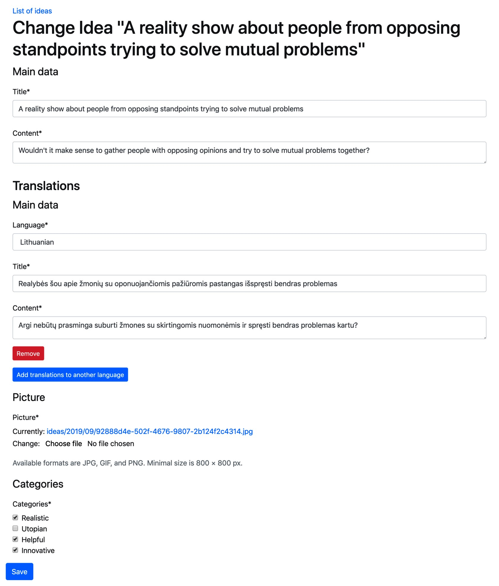

# 3.6 Работа с наборами форм

Помимо обычных или модельных форм, в Django есть концепция наборов форм. Это наборы форм одного типа, которые позволяют нам создавать или изменять сразу несколько экземпляров. Наборы форм Django могут быть обогащены **JavaScript**, что позволяет нам динамически добавлять их на страницу. Именно над этим мы и будем работать в этом рецепте. Мы расширим форму идей, чтобы можно было добавлять переводы на разные языки на одной странице.

## Подготовка

Давайте продолжим работу над **IdeaForm** из предыдущего рецепта «[Создание макета формы с помощью django-crispy-forms](3.5-sozdanie-maketa-formy-s-pomoshyu-django-crispy-forms.md)».

## Как это сделать...

Следуй этим шагам:

1. Давайте изменим макет формы для **IdeaForm**:

```python
# myproject/apps/ideas/forms.py
from django import forms
from django.utils.translation import ugettext_lazy as _
from django.conf import settings
from django.db import models

from crispy_forms import bootstrap, helper, layout

from .models import Idea

class IdeaForm(forms.ModelForm):
    class Meta:
        model = Idea
        exclude = ["author"]

    def __init__(self, request, *args, **kwargs):
        self.request = request
        super().__init__(*args, **kwargs)

        self.fields["categories"].widget = forms.CheckboxSelectMultiple()

        title_field = layout.Field(
            "title", css_class="input-block-level"
        )
        content_field = layout.Field(
            "content", css_class="input-block-level", rows="3"
        )
        main_fieldset = layout.Fieldset(
            _("Main data"), title_field, content_field
        )

        picture_field = layout.Field(
            "picture", css_class="input-block-level"
        )
        format_html = layout.HTML(
            """
"""
        )

        picture_fieldset = layout.Fieldset(
            _("Picture"),
            picture_field,
            format_html,
            title=_("Image upload"),
            css_id="picture_fieldset",
        )

        categories_field = layout.Field(
            "categories", css_class="input-block-level"
        )
        categories_fieldset = layout.Fieldset(
            _("Categories"), categories_field,
            css_id="categories_fieldset"
        )
        
        inline_translations = layout.HTML(
            """
"""
        )

        submit_button = layout.Submit("save", _("Save"))
        actions = bootstrap.FormActions(submit_button)

        self.helper = helper.FormHelper()
        self.helper.form_action = self.request.path
        self.helper.form_method = "POST"
        self.helper.layout = layout.Layout(
            main_fieldset,
            inline_translations,
            picture_fieldset,
            categories_fieldset,
            actions,
        )

        def save(self, commit=True):
            instance = super().save(commit=False)
            instance.author = self.request.user
            if commit:
                instance.save()
                self.save_m2m()
            return instance
```

2\. Затем добавим форму **IdeaTranslationsForm** в конец того же файла:

```python
class IdeaTranslationsForm(forms.ModelForm):
    language = forms.ChoiceField(
        label=_("Language"),
        choices=settings.LANGUAGES_EXCEPT_THE_DEFAULT,
        required=True,
    )

    class Meta:
        model = IdeaTranslations
        exclude = ["idea"]

    def __init__(self, request, *args, **kwargs):
        self.request = request
        super().__init__(*args, **kwargs)

        id_field = layout.Field("id")
        language_field = layout.Field(
            "language", css_class="input-block-level"
        )
        title_field = layout.Field(
            "title", css_class="input-block-level"
        )
        content_field = layout.Field(
            "content", css_class="input-block-level", rows="3"
        )
        delete_field = layout.Field("DELETE")
        main_fieldset = layout.Fieldset(
            _("Main data"),
            id_field,
            language_field,
            title_field,
            content_field,
            delete_field,
        )

        self.helper = helper.FormHelper()
        self.helper.form_tag = False
        self.helper.disable_csrf = True
        self.helper.layout = layout.Layout(main_fieldset)
```

3\. Измените представление, чтобы добавить или изменить идеи, как показано ниже.

```python
# myproject/apps/ideas/views.py
from django.contrib.auth.decorators import login_required
from django.shortcuts import render, redirect, get_object_or_404
from django.forms import modelformset_factory
from django.conf import settings

from .forms import IdeaForm, IdeaTranslationsForm
from .models import Idea, IdeaTranslations

@login_required
def add_or_change_idea(request, pk=None):
    idea = None
    if pk:
        idea = get_object_or_404(Idea, pk=pk)
    IdeaTranslationsFormSet = modelformset_factory(
        IdeaTranslations, form=IdeaTranslationsForm,
        extra=0, can_delete=True
    )
    if request.method == "POST":
        form = IdeaForm(request, data=request.POST, files=request.FILES, instance=idea)
        translations_formset = IdeaTranslationsFormSet(
            queryset=IdeaTranslations.objects.filter(idea=idea),
            data=request.POST,
            files=request.FILES,
            prefix="translations",
            form_kwargs={"request": request},
        )
        if form.is_valid() and translations_formset.is_valid():
            idea = form.save()
            translations = translations_formset.save(
                commit=False
            )
            for translation in translations:
                translation.idea = idea
                translation.save()
            translations_formset.save_m2m()
            for translation in translations_formset.deleted_objects:
                translation.delete()
            return redirect("ideas:idea_detail", pk=idea.pk)
    else:
        form = IdeaForm(request, instance=idea)
        translations_formset = IdeaTranslationsFormSet(
            queryset=IdeaTranslations.objects.filter(idea=idea),
            prefix="translations",
            form_kwargs={"request": request},
        )

    context = {
        "idea": idea,
        "form": form,
        "translations_formset": translations_formset
    }
    return render(request, "ideas/idea_form.html", context)
```

4\. Затем отредактируем шаблон `idea_form.html` и добавим в конец ссылку на файл скрипта `inlines.js`:

```django
{# ideas/idea_form.html #}





    <a href=""></a>
    <h1>
        
            
                Change Idea "{{ title }}"
            
        
            
        
    </h1>
    



    <script src=""></script>


```

5\. Создайте шаблон для наборов форм перевода:

```django
{# ideas/forms/translations.html #}


<section id="translations_section" class="formset my-3">
    {{ translations_formset.management_form }}
    <h3></h3>
    <div class="formset-forms">
        
            <div class="formset-form">
                
            </div>
        
    </div>
    <button type="button" class="btn btn-primary btn-sm
        add-inline-form"></button>
    <div class="empty-form d-none">
        

    </div>
</section>
```

6\. И последнее, но не менее важное: добавьте **JavaScript** для управления наборами форм:

```javascript
/* site/js/inlines.js */
window.WIDGET_INIT_REGISTER = window.WIDGET_INIT_REGISTER || [];

$(function () {
    function reinit_widgets($formset_form) {
        $(window.WIDGET_INIT_REGISTER).each(function (index, func)
        {
            func($formset_form);
        });
    }

    function set_index_for_fields($formset_form, index) {
        $formset_form.find(':input').each(function () {
            var $field = $(this);
            if ($field.attr("id")) {
                $field.attr(
                    "id",
                    $field.attr("id").replace(/-__prefix__-/, "-" + index + "-")
                );
            }
            if ($field.attr("name")) {
                $field.attr(
                    "name",
                    $field.attr("name").replace(/-__prefix__-/, "-" + index + "-")
                );
            }
        });
        $formset_form.find('label').each(function () {
            var $field = $(this);
            if ($field.attr("for")) {
                $field.attr(
                    "for",
                    $field.attr("for").replace(/-__prefix__-/, "-" + index + "-")
                );
            }
        });
        $formset_form.find('div').each(function () {
            var $field = $(this);
            if ($field.attr("id")) {
                $field.attr(
                    "id",
                    $field.attr("id").replace(/-__prefix__-/, "-" + index + "-")
                );
            }
        });
    }

    function add_delete_button($formset_form) {
        $formset_form.find('input:checkbox[id$=DELETE]').each(function () {
            var $checkbox = $(this);
            var $deleteLink = $(
                '<button class="delete btn btn-sm btn-danger mb-3">Remove</button>'
            );
            $formset_form.append($deleteLink);
            $checkbox.closest('.form-group').hide();
        });
    }

    $('.add-inline-form').click(function (e) {
        e.preventDefault();
        var $formset = $(this).closest('.formset');
        var $total_forms = $formset.find('[id$="TOTAL_FORMS"]');
        var $new_form = $formset.find('.empty-form').clone(true).attr("id", null);
        $new_form.removeClass('empty-form d-none').addClass('formset-form');
        set_index_for_fields($new_form, parseInt($total_forms.val(), 10));
        $formset.find('.formset-forms').append($new_form);
        add_delete_button($new_form);
        $total_forms.val(parseInt($total_forms.val(), 10) + 1);
        reinit_widgets($new_form);
    });

    $('.formset-form').each(function () {
        $formset_form = $(this);
        add_delete_button($formset_form);
        reinit_widgets($formset_form);
    });

    $(document).on('click', '.delete', function (e) {
        e.preventDefault();
        var $formset = $(this).closest('.formset-form');
        var $checkbox = $formset.find('input:checkbox[id$=DELETE]');
        $checkbox.attr("checked", "checked");
        $formset.hide();
    });
});
```

## Как это работает...

Возможно, вы знаете о наборах форм из администрации модели Django. Наборы форм используются там в механизме инлайнов для дочерних моделей, имеющих внешние ключи к родительской модели.

В этом рецепте мы добавили наборы форм в форму идеи, используя **django-crispy-forms**. Результат будет выглядеть так:

<figure><figcaption></figcaption></figure>

Как видите, мы можем вставлять наборы форм не обязательно в конец формы, а где угодно между ними, где это имеет смысл. В нашем примере имеет смысл перечислять переводы сразу после переводимых полей.

Макет формы для форм перевода имеет основной набор полей, как и макет **IdeaForm**, но, кроме того, в нем есть поля **id** и **DELETE**, которые необходимы для распознавания каждого экземпляра модели и возможности удалить их из списка. Поле **DELETE** на самом деле является флажком, который, если он установлен, удаляет соответствующий элемент из базы данных. Кроме того, помощник формы для перевода имеет `form_tag=False`, который не генерирует тег, и `disable_csrf=True`, который не включает токен **CSRF**, поскольку мы уже определили их в родительской форме, **IdeaForm**. .

В представлении, если запрос отправляется методом **POST** и и форма, и набор форм действительны, то мы сохраняем форму и создаем соответствующие экземпляры перевода, не сохраняя их сначала. Это делается с помощью атрибута `commit=False`. Для каждого экземпляра перевода мы назначаем идею, а затем сохраняем переводы в базу данных. Наконец, мы проверяем, были ли какие-либо формы в наборе форм отмечены для удаления, и удаляем их из базы данных.

В шаблоне `translations.html` мы отображаем каждую форму в наборе форм, а затем добавляем дополнительную скрытую пустую форму, которая будет использоваться **JavaScript** для создания новых форм набора форм, которые будут добавляться динамически.

Каждая форма набора форм имеет префиксы для всех полей. Например, поле заголовка **title** первой формы набора форм будет иметь имя поля HTML `«translations-0-title»`, а поле **DELETE** той же формы набора форм будет иметь имя поля HTML `«translations-0-DELETE»`. Пустая форма имеет слово `«__prefix__»` вместо индекса, например, «`translations-__prefix__-title`». Это абстрагировано на уровне Django, но необходимо знать для управления формами набора форм с помощью **JavaScript**.

JavaScript `inlines.js` делает несколько вещей:

* Для каждой существующей формы набора форм он инициализирует свои виджеты на основе JavaScript (вы можете использовать всплывающие подсказки, средства выбора дня или цвета, карты и т. д.) и создает кнопку удаления, которая отображается вместо флажка **DELETE**.
* Когда нажимается кнопка удаления, она устанавливает флажок **DELETE** и скрывает форму набора форм от пользователя.
* Когда нажимается кнопка добавления, она клонирует пустую форму и заменяет `«__prefix__»` следующим доступным индексом, добавляет новую форму в список и инициирует виджеты на основе JavaScript.

## Дополнительно

В JavaScript используется массив `window.WIDGET_INIT_REGISTER`, который содержит функции, которые следует вызывать для запуска виджетов с заданной формой набора форм. Чтобы зарегистрировать новую функцию в другом файле JavaScript, вы можете сделать следующее:

```javascript
/* site/js/main.js */
function apply_tooltips($formset_form) {
    $formset_form.find('[data-toggle="tooltip"]').tooltip();
}

/* зарегистрировать инициализацию виджета для формы набора форм */
window.WIDGET_INIT_REGISTER = window.WIDGET_INIT_REGISTER || [];
window.WIDGET_INIT_REGISTER.push(apply_tooltips);
```

Это применит функциональность всплывающей подсказки для всех вхождений в формах набора форм, где теги в разметке имеют атрибуты `data-toggle="tooltip"` и **title**, как в этом примере:

```django
<button data-toggle="tooltip" title="
">
    

</button>
```

## Смотрите также

* Рецепт [Создание макета формы с помощью django-crispy-forms](3.5-sozdanie-maketa-formy-s-pomoshyu-django-crispy-forms.md)
* Рецепт Упорядочивания шаблона base.html в Главе 4, Шаблоны и JavaScript
