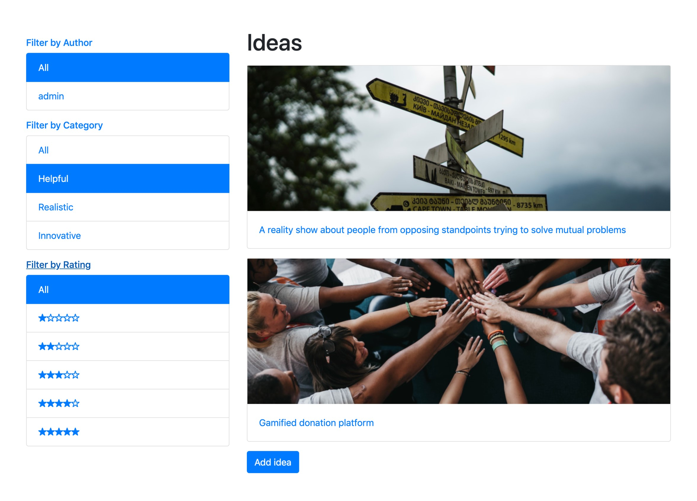

# 3.7 Фильтрация списков объектов

В веб-разработке, помимо представлений с формами, обычно используются представления списка объектов и подробные представления. Списковые представления могут просто перечислять объекты, упорядоченные, например, по алфавиту или по дате создания; однако это не очень удобно для пользователя с огромными объемами данных. Для лучшей доступности и удобства вы должны иметь возможность фильтровать контент по всем возможным категориям. В этом рецепте мы увидим шаблон, который используется для фильтрации представлений списка по любому количеству категорий.

Мы создадим список идей, которые можно отфильтровать по автору, категории или рейтингу. С примененным к нему **Bootstrap 4** это будет выглядеть примерно так:

<figure><figcaption></figcaption></figure>

## Подготовка

Для примера фильтрации мы будем использовать модель **Idea** по отношению к автору и категориям для фильтрации. Также можно будет фильтровать по рейтингу, то есть **PositiveIntegerField** с вариантами выбора. Давайте воспользуемся приложением **ideas** с моделями, которые мы создали в предыдущих рецептах.

## Как это сделать...
