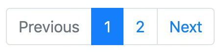

# 3.8 Управление списками с разбивкой на страницы

Если у вас есть динамически изменяющиеся списки объектов или их количество превышает **24** или около того, вам, вероятно, понадобится разбиение на страницы, чтобы обеспечить удобство работы пользователя. Вместо полного **QuerySet** разбивка на страницы предоставляет определенное количество элементов в наборе данных, соответствующее размеру одной страницы. Мы также показываем ссылки, позволяющие пользователям получить доступ к другим страницам, составляющим полный набор данных. В Django есть классы для управления разбитыми на страницы данными, и в этом рецепте мы увидим, как их использовать.

## Подготовка

Начнем с моделей, форм и представлений приложения **ideas** из рецепта «[Фильтрация списков объектов](3.7-filtraciya-spiskov-obektov.md)».

## Как это сделать...

Чтобы добавить нумерацию страниц в представление списка идей, выполните следующие действия:

1. Импортируйте необходимые классы пагинации из Django в файл **views.py**. Мы добавим управление разбиением на страницы в представление **idea\_list** сразу после фильтрации. Также немного изменим контекстный словарь, назначив **page** ключу **object\_list**:

```python
# myproject/apps/ideas/views.py
from django.shortcuts import render, redirect, get_object_or_404
from django.conf import settings
from django.core.paginator import (EmptyPage, PageNotAnInteger, Paginator)

from .forms import IdeaFilterForm
from .models import Idea, RATING_CHOICES

PAGE_SIZE = getattr(settings, "PAGE_SIZE", 24)

def idea_list(request):
    qs = Idea.objects.order_by("title")
    form = IdeaFilterForm(data=request.GET)
    facets = {
        "selected": {},
        "categories": {
            "authors": form.fields["author"].queryset,
            "categories": form.fields["category"].queryset,
            "ratings": RATING_CHOICES,
        },
    }

    if form.is_valid():
        filters = (
            # параметр запроса, параметр фильтра
            ("author", "author"),
            ("category", "categories"),
            ("rating", "rating"),
        )
        qs = filter_facets(facets, qs, form, filters)

    paginator = Paginator(qs, PAGE_SIZE)
    page_number = request.GET.get("page")
    try:
        page = paginator.page(page_number)
    except PageNotAnInteger:
        # Если страница не является целым числом, показать первую страницу.
        page = paginator.page(1)
    except EmptyPage:
        # Если страница вне допустимого диапазона,
        # показать последнюю существующую страницу.
        page = paginator.page(paginator.num_pages)

    context = {
        "form": form,
        "facets": facets,
        "object_list": page,
    }
    return render(request, "ideas/idea_list.html", context)
```

2\. Измените шаблон `idea_list.html` следующим образом:

```django
{# ideas/idea_list.html #}





    



    <h1></h1>
    
        
            <a href="{{ idea.get_url_path }}" class="d-block my-3">
                <div class="card">
                    
                    <div class="card-body">
                        <p class="card-text">{{ idea.translated_title }}</p>
                    </div>
                </div>
            </a>
        
        
    
        <p></p>
    
    <a href="" class="btn btn-primary">
        
    </a>


```

3\. Создайте шаблон виджета пагинации:

```django
{# misc/includes/pagination.html #}




    <nav aria-label="">

        <ul class="pagination">
            
                <li class="page-item">
                   <a class="page-link"
                       href="">
                       
                   </a>
                </li>
            
                <li class="page-item disabled">
                    <span class="pagelink"></span>
                </li>
            

            
                
                    <li class="page-item active">
                        <span class="page-link">{{ page_number }}
                            <span class="sr-only"></span>
                        </span>
                    </li>
                
                    <li class="page-item">
                        <a class="page-link" href="">
                            {{ page_number }}
                        </a>
                    </li>
                
            

            
                <li class="page-item">
                    <a class="page-link"
                       href="">
                        
                    </a>
                </li>
            
                <li class="page-item disabled">
                    <span class="pagelink"></span>
                </li>
            
        </ul>
    </nav>


```

## Как это работает...

Когда вы посмотрите на результаты в браузере, вы увидите элементы управления разбиением на страницы, подобные следующим:

<figure><figcaption></figcaption></figure>

Как мы этого добиваемся? Когда **QuerySet** отфильтрован, мы создадим объект **paginator**, передающий **QuerySet** и максимальное количество элементов, которые мы хотим отобразить на странице, которое здесь равно **24**. Затем мы прочитаем номер текущей страницы из параметра запроса **page**. Следующим шагом является получение текущего объекта страницы из пагинатора. Если номер страницы не является целым числом, мы получаем первую страницу. Если число превышает количество возможных страниц, извлекается последняя страница. Объект страницы имеет методы и атрибуты, необходимые для виджета разбиения на страницы, показанного на предыдущем снимке экрана. Кроме того, объект страницы действует как **QuerySet**, поэтому мы можем перебирать его и получать элементы из части страницы.

Фрагмент, отмеченный в шаблоне, создает виджет разбиения на страницы с разметкой для интерфейса **Bootstrap 4**. Мы показываем элементы управления пагинацией, только если страниц больше, чем текущая. У нас есть ссылки на предыдущую и следующую страницы, а также список всех номеров страниц в виджете. Текущий номер страницы помечен как активный. Чтобы сгенерировать URL-адреса для ссылок, мы используем тег шаблона ``, который будет описан позже в рецепте _Создание тега шаблона для изменения параметров запроса_ в Главе 5, _Пользовательские фильтры и теги шаблона_.

## Смотрите также

* Рецепт [списка объектов фильтрации](3.7-filtraciya-spiskov-obektov.md)
* Рецепт [создания представлений на основе классов](3.9-sostavlenie-predstavlenii-na-osnove-klassov.md)
* Рецепт Создание тега шаблона для изменения параметров запроса запроса в Главе 5, Пользовательские фильтры шаблонов и теги
