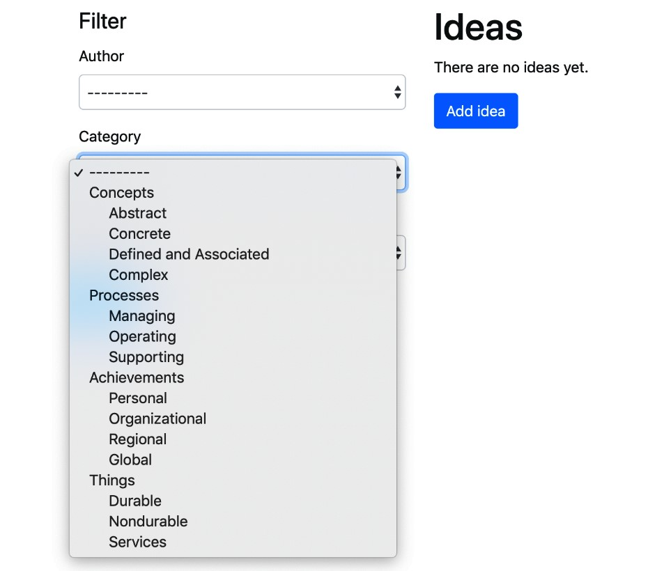

# Использование одного поля selection для выбора категории в формах с django-mptt

Что произойдет, если вы хотите показать выбор категории в форме? Как будет представлена иерархия? В **django-mptt** есть специальное поле формы **TreeNodeChoiceField**, которое можно использовать для отображения иерархических структур в выбранном поле. Давайте посмотрим, как это сделать.

## Подготовка

Мы начнем с приложений **categories** и **ideas**, которые мы определили в предыдущих рецептах. Для этого рецепта нам также понадобятся **django-crispy-forms**. Посмотрите, как его установить, в рецепте _Создание макета формы с помощью django-crispy-forms_ в Главе 3, _Формы и представления_.

## Как это сделать...

Давайте улучшим форму фильтра для **ideas**, которую мы создали в рецепте _Фильтрация списков_ объектов в Главе 3, _Формы и представления_, добавив поле для фильтрации по категории:

1. В файле **forms.py** приложения **ideas** создайте форму с полем категории следующим образом:

```python
# myproject/apps/ideas/forms.py
from django import forms
from django.utils.safestring import mark_safe
from django.utils.translation import ugettext_lazy as _
from django.contrib.auth import get_user_model

from crispy_forms import bootstrap, helper, layout
from mptt.forms import TreeNodeChoiceField

from myproject.apps.categories.models import Category

from .models import Idea, RATING_CHOICES

User = get_user_model()

class IdeaFilterForm(forms.Form):
    author = forms.ModelChoiceField(
        label=_("Author"),
        required=False,
        queryset=User.objects.all(),
    )
    category = TreeNodeChoiceField(
        label=_("Category"),
        required=False,
        queryset=Category.objects.all(),
        level_indicator=mark_safe("&nbsp;&nbsp;&nbsp;&nbsp;")
    )
    rating = forms.ChoiceField(
        label=_("Rating"), required=False, choices=RATING_CHOICES
    )

    def __init__(self, *args, **kwargs):
        super().__init__(*args, **kwargs)
        author_field = layout.Field("author")
        category_field = layout.Field("category")
        rating_field = layout.Field("rating")
        submit_button = layout.Submit("filter", _("Filter"))
        actions = bootstrap.FormActions(submit_button)
        main_fieldset = layout.Fieldset(
            _("Filter"),
            author_field,
            category_field,
            rating_field,
            actions,
        )
        self.helper = helper.FormHelper()
        self.helper.form_method = "GET"
        self.helper.layout = layout.Layout(main_fieldset)
```

2\. Мы уже должны были создать **IdeaListView**, связанное с ним правило URL и шаблон **idea\_list.html** для отображения этой формы. Обязательно отобразите форму фильтра в шаблоне с помощью тега шаблона `` следующим образом:

```django
{# ideas/idea_list.html #}





    



    {# … #}


```

## Как это работает...

Раскрывающееся меню выбора категории будет выглядеть следующим образом:

<figure><figcaption></figcaption></figure>

**TreeNodeChoiceField** действует как **ModelChoiceField**; однако он показывает иерархический выбор с отступом. По умолчанию **TreeNodeChoiceField** представляет каждый более глубокий уровень с префиксом из трех дефисов `---`. В нашем примере мы изменили индикатор уровня на четыре неразрывных пробела (объекты `&nbsp;` HTML), передав в поле параметр **level\_indicator**. Чтобы убедиться, что неразрывные пробелы не экранированы, мы используем функцию `mark_safe()`.

## Смотрите также

* Рецепт [Категории рендеринга в шаблоне django-mptt](otobrazhenie-kategorii-v-shablone-s-pomoshyu-django-mptt.md)
* Рецепт _Использование списка флажков для выбора нескольких категорий в формах с django-mptt_
