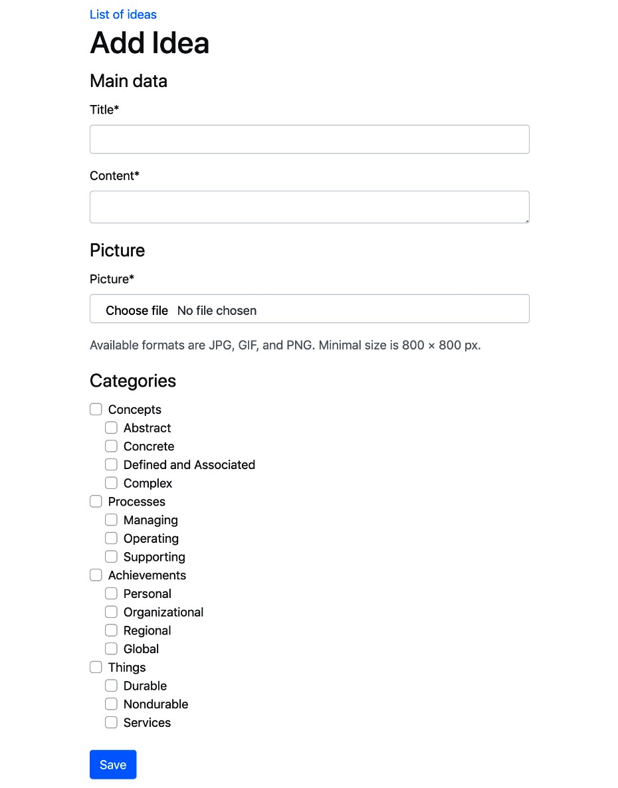

# Использование списка флажков для выбора нескольких категорий в формах с django-mptt

Когда в форме необходимо одновременно выбрать одну или несколько категорий, вы можете использовать поле множественного выбора **TreeNodeMultipleChoiceField**, предоставляемое **django-mptt**. Однако несколько полей выбора (например, `<select multiple>`) не очень удобны для пользователя с точки зрения интерфейса, так как пользователю необходимо прокручивать и удерживать управляющие или командные клавиши, щелкая, чтобы сделать несколько вариантов выбора. Особенно, когда есть довольно большое количество элементов на выбор, и пользователь хочет выбрать несколько сразу, или у пользователя есть проблемы с доступностью, такие как плохое управление моторикой, это может привести к действительно ужасному пользовательскому опыту. Гораздо лучший подход — предоставить список флажков, из которого пользователь может выбирать категории. В этом рецепте мы создадим поле, позволяющее отображать иерархическую древовидную структуру в виде флажков с отступом в форме.

## Подготовка

Мы начнем с приложений **categories** и **ideas**, которые мы определили в предыдущих рецептах, и приложения **core**, которое должно быть в вашем проекте.

## Как это сделать...

Чтобы отобразить список категорий с отступом и флажками, мы создадим и будем использовать новое поле формы **MultipleChoiceTreeField** и создадим HTML-шаблон для этого поля.

Конкретный шаблон будет передан макету **crispy\_forms** в форме. Для этого выполните следующие шаги:

1. В приложении **core** добавьте файл **form\_fields.py** и создайте поле формы **MultipleChoiceTreeField**, которое расширяет **ModelMultipleChoiceField**, как показано ниже.

<pre class="language-python"><code class="lang-python"># myproject/apps/core/form_fields.py
from django import forms

class MultipleChoiceTreeField(forms.ModelMultipleChoiceField):
<strong>    widget = forms.CheckboxSelectMultiple
</strong><strong>
</strong>    def label_from_instance(self, obj):
        return obj</code></pre>

2\. Используйте новое поле с категориями чтобы выбрать из новой формы для создания идей. Кроме того, в макете формы передайте настраиваемый шаблон в поле **categories**, как показано ниже:

```python
# myproject/apps/ideas/forms.py
from django import forms
from django.utils.translation import ugettext_lazy as _
from django.contrib.auth import get_user_model

from crispy_forms import bootstrap, helper, layout

from myproject.apps.categories.models import Category
from myproject.apps.core.form_fields import MultipleChoiceTreeField

from .models import Idea, RATING_CHOICES

User = get_user_model()

class IdeaForm(forms.ModelForm):
    categories = MultipleChoiceTreeField(
        label=_("Categories"),
        required=False,
        queryset=Category.objects.all(),
    )

    class Meta:
        model = Idea
        exclude = ["author"]

    def __init__(self, request, *args, **kwargs):
        self.request = request
        super().__init__(*args, **kwargs)

        title_field = layout.Field("title")
        content_field = layout.Field("content", rows="3")
        main_fieldset = layout.Fieldset(_("Main data"),
            title_field, content_field)
        picture_field = layout.Field("picture")
        format_html = layout.HTML(
            """"""
        )

        picture_fieldset = layout.Fieldset(
            _("Picture"),
            picture_field,
            format_html,
            title=_("Image upload"),
            css_id="picture_fieldset",
        )

        categories_field = layout.Field(
            "categories",
            template="core/includes/checkboxselectmultiple_tree.html"
        )
        categories_fieldset = layout.Fieldset(
            _("Categories"), categories_field,
            css_id="categories_fieldset"
        )

        submit_button = layout.Submit("save", _("Save"))
        actions = bootstrap.FormActions(submit_button, css_class="my-4")

        self.helper = helper.FormHelper()
        self.helper.form_action = self.request.path
        self.helper.form_method = "POST"
        self.helper.layout = layout.Layout(
            main_fieldset,
            picture_fieldset,
            categories_fieldset,
            actions,
        )

    def save(self, commit=True):
        instance = super().save(commit=False)
        instance.author = self.request.user
        if commit:
            instance.save()
            self.save_m2m()
        return instance
```

3\. Создайте шаблон для списка флажков в стиле Bootstrap на основе шаблона **crispy** форм `bootstrap4/layoutcheckboxselectmultiple.html`, как показано ниже:

<pre class="language-django"><code class="lang-django">{# core/include/checkboxselectmultiple_tree.html #}


&#x3C;div class=" {{ field_class }}" {{ flat_attrs|safe }}>

<strong>    
</strong>        &#x3C;div class="custom-control customcheckbox
           custom-control-inline
          form-check form-checkinline
          ">
            &#x3C;input type="checkbox" class="
                custom-control-inputform-check-input
                 is-invalid"
                
                  checked="checked" name="{{ field.html_name }}"
                  id="id_{{ field.html_name }}_{{ forloop.counter }}"
                  value="{{ choice_value|unlocalize }}"
                  {{ field.field.widget.attrs|flatatt }}>
            &#x3C;label class="custom-controllabel
                form-check-label
                level-{{ choice_instance.level }}"
                for="id_{{ field.html_name }}_{{ forloop.counter }}">
                    {{ choice_instance|unlocalize }}
            &#x3C;/label>
        
        
            
        &#x3C;/div>
    

    
        &#x3C;div class="w-100 custom-control
            custom-checkbox custom-control-inline
            form-check form
            check-inline">
                &#x3C;input type="checkbox" class="custom-control-input
                is-invalid">
            
        &#x3C;/div>
    


&#x3C;/div></code></pre>

4\. Создайте новое представление для добавления идеи, используя форму, которую мы только что создали:

```python
# myproject/apps/ideas/views.py
from django.contrib.auth.decorators import login_required
from django.shortcuts import render, redirect, get_object_or_404

from .forms import IdeaForm
from .models import Idea

@login_required
def add_or_change_idea(request, pk=None):
    idea = None
    if pk:
        idea = get_object_or_404(Idea, pk=pk)
    if request.method == "POST":
        form = IdeaForm(
            request, data=request.POST,
            files=request.FILES, instance=idea
        )
        if form.is_valid():
            idea = form.save()
            return redirect("ideas:idea_detail", pk=idea.pk)
    else:
        form = IdeaForm(request, instance=idea)

    context = {"idea": idea, "form": form}
    return render(request, "ideas/idea_form.html", context)
```

5\. Добавьте связанный шаблон для отображения формы с тегом шаблона ``, об использовании которого вы можете узнать больше в рецепте _Создание макета формы с помощью django-crispy-forms_ в Главе 3, _Формы и представления_:

```django
{# ideas/idea_form.html #}





    <a href=""></a>
    <h1>
        
            
                Change Idea "{{ title }}"
            
        
            
        
    </h1>



```

6\. Нам также нужно правило URL, указывающее на новое представление, как показано ниже:

```python
# myproject/apps/ideas/urls.py
from django.urls import path

from .views import add_or_change_idea

urlpatterns = [
    # …
    path("add/", add_or_change_idea, name="add_idea"),
    path("<uuid:pk>/change/", add_or_change_idea, name="change_idea"),
]
```

7\. Добавьте в свой файл CSS правила для отступа меток с использованием классов, сгенерированных в шаблоне поля дерева флажков, таких как `.level-0`, `.level-1` и `.level-2`, установив параметр **margin-left**. Убедитесь, что у вас есть разумное количество этих классов CSS для ожидаемой максимальной глубины деревьев в вашем контексте, как показано ниже:

```css
/* myproject/site_static/site/css/style.css */
.level-0 {margin-left: 0;}
.level-1 {margin-left: 20px;}
.level-2 {margin-left: 40px;}
```

## Как это работает...

В результате получаем следующий вид:

<figure><figcaption></figcaption></figure>

В отличие от стандартного поведения Django, которое жестко задает создание полей в коде Python, приложение **django-crispy-forms** использует шаблоны для отображения полей. Вы можете просмотреть их в `crispy_forms/templates/bootstrap4` и скопировать некоторые из них по аналогичному пути в каталоге шаблонов вашего проекта, чтобы при необходимости перезаписать их.

В нашей форме создания и редактирования идеи мы передаем настраиваемый шаблон для поля **categories**, который добавит классы CSS `.level-*` в тег `<label>`, оборачивая флажки. Одна проблема с обычным виджетом **CheckboxSelectMultiple** заключается в том, что при отображении он использует только значения выбора и тексты выбора, тогда как нам нужны другие свойства категории, такие как уровень глубины. Чтобы решить эту проблему, мы также создали пользовательское поле формы **MultipleChoiceTreeField**, которое расширяет **ModelMultipleChoiceField** и переопределяет метод `label_from_instance()` для возврата самого экземпляра категории вместо его представления в формате Unicode. Шаблон поля выглядит сложным; однако в основном это переработанный шаблон поля с несколькими флажками (`crispy_forms/templates/bootstrap4/layout/checkboxselectmultiple.html`) со всей необходимой разметкой Bootstrap. В основном мы сделали небольшую модификацию, добавив классы CSS `.level-*`.

## Смотрите также

* Рецепт _Создание макета формы с помощью django-crispy-forms_ в Главе 3, _Формы и представления_
* Рецепт [Категории рендеринга в шаблоне с django-mptt](otobrazhenie-kategorii-v-shablone-s-pomoshyu-django-mptt.md)
* Рецепт [Использование одного поля выбора для выбора категории в формах](ispolzovanie-odnogo-polya-selection-dlya-vybora-kategorii-v-formakh-s-django-mptt.md)
