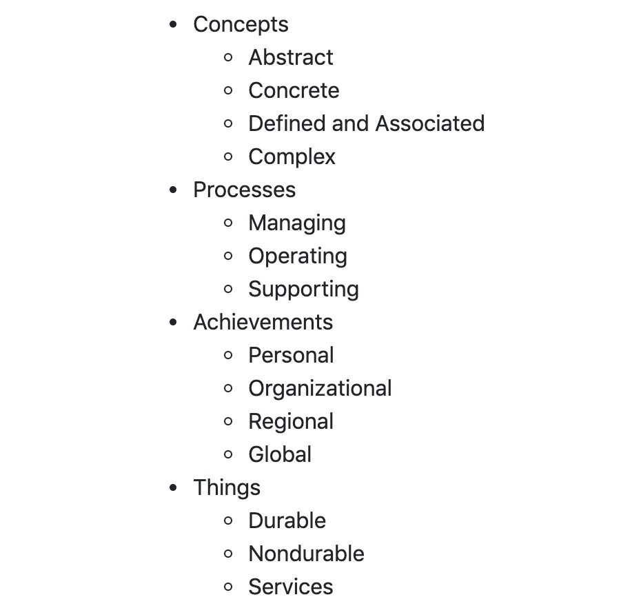

# Отображение категорий в шаблоне с помощью django-mptt

После того, как вы создали категории в своем приложении, вам необходимо отобразить их иерархически в шаблоне. Самый простой способ сделать это с MPTT-деревьями, как описано в рецепте [Создание иерархических категорий с помощью django-mptt](sozdanie-ierarkhicheskikh-kategorii-s-django-mptt.md), — использовать тег шаблона `` из приложения **django-mptt**. Мы покажем вам, как это сделать в этом рецепте.

## Подготовка

Убедитесь, что у вас есть приложения **categories** и **ideas**. Там ваша модель идеи должна иметь отношение «многие ко многим» к модели **Category** в соответствии с рецептом «[Создание иерархических категорий с помощью django-mptt](sozdanie-ierarkhicheskikh-kategorii-s-django-mptt.md)». Введите эти категории в базу данных.

## Как это сделать...

Передайте **QuerySet** ваших иерархических категорий в шаблон, а затем используйте тег шаблона `` следующим образом:

1. Создайте представление, которое загружает все категории и передает их в шаблон:

```python
# myproject/apps/categories/views.py
from django.views.generic import ListView

from .models import Category

class IdeaCategoryList(ListView):
    model = Category
    template_name = "categories/category_list.html"
    context_object_name = "categories"
```

2\. Создайте шаблон со следующим содержимым для вывода иерархии категорий:

```django
{# categories/category_list.html #}





    <ul class="root">
        
            <li>
                {{ node.title }}
                
                    <ul class="children">
                        {{ children }}
                    </ul>
                
            </li>
        
    </ul>


```

3\. Создайте правило URL для отображения представления:

```python
# myproject/urls.py
from django.conf.urls.i18n import i18n_patterns
from django.urls import path

from myproject.apps.categories import views as categories_views

urlpatterns = i18n_patterns(
    # …
    path(
        "idea-categories/",
        categories_views.IdeaCategoryList.as_view(),
        name="idea_categories",
    ),
)
```

## Как это работает...

Шаблон будет отображаться в виде вложенных списков, как показано на следующем снимке экрана:

<figure><figcaption></figcaption></figure>

Тег шаблона блока `` принимает **QuerySet** категорий и отображает список, используя содержимое шаблона, вложенное в тег. Здесь используются две специальные переменные:

* Переменная **node** — это экземпляр модели **Category**, поля или методы которой можно использовать для добавления определенных классов CSS или атрибутов `data-*` HTML5 для JavaScript, таких как `{{ node.get_descendent_count }}`, `{{ node.level }}` или `{{ node.is_root }}`.
* Во-вторых, у нас есть переменная **children**, которая определяет, где будут размещены отображаемые дочерние узлы текущей категории.

## Есть еще кое-что...

Если ваша иерархическая структура очень сложная, с более чем 20 уровнями, рекомендуется использовать итеративные теги `` и `` или нерекурсивный фильтр шаблона **tree\_info**.


Для получения дополнительной информации о том, как это сделать, обратитесь к официальной документации по [адресу django-mptt](https://django-mptt.readthedocs.io/en/latest/templates.html#iterative-tags).


## Смотрите также

* Рецепт «Использование атрибутов данных HTML5» в главе 4 «Шаблоны и JavaScript».
* Рецепт [создания иерархических категорий с помощью django-mptt](sozdanie-ierarkhicheskikh-kategorii-s-django-mptt.md)
* Рецепт создания иерархических категорий с помощью django-treebeard
* Использование одного поля выбора для выбора категории в формах с рецептом django-mptt
