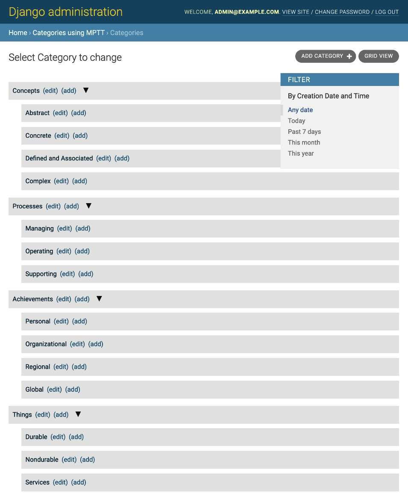
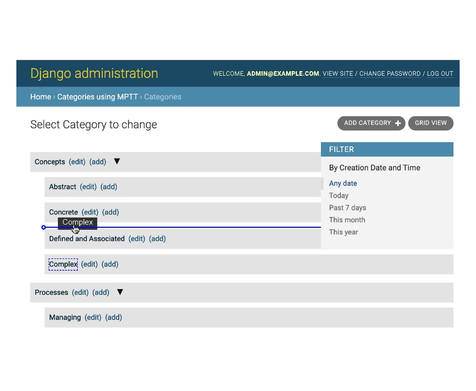
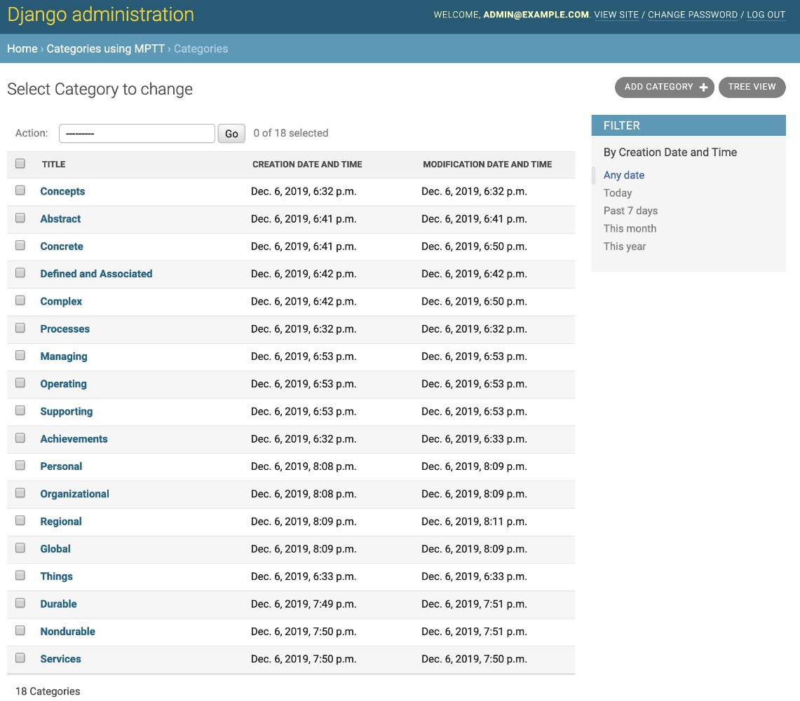

# Создание интерфейса администрирования категорий с django-mptt-admin

Приложение **django-mptt** поставляется с простым миксином для администрирования моделей, который позволяет создавать древовидную структуру и перечислять ее с отступом. Чтобы изменить порядок деревьев, вам нужно либо создать этот функционал самостоятельно, либо использовать стороннее решение. Одним из приложений, которое может помочь вам создать перетаскиваемый интерфейс администрирования для иерархических моделей, является **django-mptt-admin**. Давайте посмотрим на это в этом рецепте.

## Подготовка

Сначала настройте приложение категорий, как описано в предыдущем разделе [Создание иерархических категорий с помощью рецепта django-mptt](sozdanie-ierarkhicheskikh-kategorii-s-django-mptt.md). Затем нам нужно установить приложение **django-mptt-admin**, выполнив следующие шаги:

1. Установите приложение в виртуальной среде с помощью следующей команды:

```bash
(env)$ pip install django-mptt-admin==0.7.2
```

2\. Поместите его в **INSTALLED\_APPS** в настройках следующим образом:

```python
# myproject/settings/_base.py
INSTALLED_APPS = [
    # …
    "mptt",
    "django_mptt_admin",
]
```

3\. Убедитесь, что статические файлы для **django-mptt-admin** доступны для вашего проекта:

```bash
(env)$ python manage.py collectstatic
```

## Как это сделать...

Создайте файл **admin.py**, в котором мы определим интерфейс администрирования для модели **Category**. Он расширяется **DjangoMpttAdmin** вместо **admin.ModelAdmin** следующим образом:

```python
# myproject/apps/categories/admin.py
from django.contrib import admin
from django_mptt_admin.admin import DjangoMpttAdmin

from .models import Category

@admin.register(Category)
class CategoryAdmin(DjangoMpttAdmin):
    list_display = ["title", "created", "modified"]
    list_filter = ["created"]
```

## Как это работает...

Интерфейс администрирования категорий будет иметь два режима: **tree view** и **grid view**. Ваше древовидное представление **tree view** будет выглядеть примерно так, как показано на следующем снимке экрана:

<figure><figcaption></figcaption></figure>

Представление в виде дерева использует библиотеку **jqTree** jQuery для управления узлами. Вы можете разворачивать и сворачивать категории для лучшего обзора. Чтобы изменить их порядок или изменить зависимости, вы можете перетаскивать заголовки в этом представлении списка. Во время изменения порядка пользовательский интерфейс (**UI**) выглядит примерно так, как показано на следующем снимке экрана:

<figure><figcaption></figcaption></figure>

Обратите внимание, что любые обычные настройки, связанные со списками, такие как **list\_display** или **list\_filter**, будут игнорироваться в древовидном представлении. Кроме того, любое упорядочение, определяемое метасвойством **order\_insertion\_by**, будет переопределено ручной сортировкой.

Если вы хотите отфильтровать категории, отсортировать их по определенному полю или применить действия администратора, вы можете переключиться на представление сетки **grid view**, в котором отображается список изменений категорий по умолчанию, как показано на следующем снимке экрана:

<figure><figcaption></figcaption></figure>

## Смотрите также

* Рецепт [создания иерархических категорий с помощью django-mptt](sozdanie-ierarkhicheskikh-kategorii-s-django-mptt.md)
* Рецепт Создание интерфейса управления категориями с помощью django-treebeard
