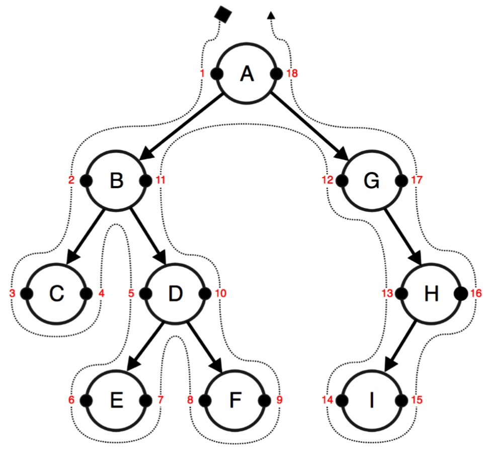

# Введение

Независимо от того, создаете ли вы свой собственный форум, ветки комментариев или систему категоризации, наступит момент, когда вам потребуется сохранить иерархические структуры в базе данных. Хотя таблицы реляционных баз данных (таких как MySQL и PostgreSQL) являются плоскими, существует быстрый и эффективный способ хранения иерархических структур. Это называется модифицированным обходом дерева предзаказов (**MPTT**). MPTT позволяет читать древовидные структуры без рекурсивных обращений к базе данных.

Во-первых, давайте познакомимся с терминологией древовидных структур. Древовидная структура данных представляет собой вложенный набор узлов, начиная с корневого узла и со ссылками на дочерние узлы. Существуют ограничения: например, ни один узел не должен ссылаться назад для создания цикла, и никакая ссылка не должна дублироваться. Ниже приведены некоторые другие термины, которые следует помнить:

* Родитель (**parent**) — это любой узел, который имеет ссылки на дочерние узлы.
* Потомки (**descendants**) — это узлы, до которых можно добраться путем рекурсивного перехода от родителя к его дочерним элементам. Следовательно, потомки узла будут его дочерними элементами, дочерними элементами дочерних элементов и так далее.
* Предки (**ancestors**) — это узлы, до которых можно добраться путем рекурсивного перехода от дочернего узла к его родительскому. Следовательно, предки узла будут его родителем, родителем родителя и так далее до корня.
* Братья и сестры (**siblings**) — это узлы с одним и тем же родителем.
* Лист (**leaf**) — это узел без потомков.

Теперь я объясню, как работает **MPTT**. Представьте, что вы разложили свое дерево горизонтально с корневым узлом наверху. Каждый узел в дереве имеет левое и правое значения. Представьте их в виде маленьких левой и правой ручек на левой и правой сторонах узла. Затем вы ходите (обходите) вокруг дерева против часовой стрелки, начиная с корневого узла, и отмечаете каждое найденное левое или правое значение числом: 1, 2, 3 и так далее. Это будет похоже на следующую схему:

<figure><figcaption></figcaption></figure>

В таблице базы данных этой иерархической структуры у вас есть заголовок, левое значение и правое значение для каждого узла.

Теперь, если вы хотите получить поддерево узла **B** с **2** в качестве левого значения и **11** в качестве правого значения, вам нужно будет выбрать все узлы, которые имеют левое значение от **2** до **11**. Это **C**, **D** , **Е** и **F**.

Чтобы получить всех предков узла **D** с **5** в качестве левого значения и **10** в качестве правого значения, вы должны выбрать все узлы, у которых левое значение меньше **5**, а правое значение больше **10.** Это будут **B** и **A**.

Чтобы получить количество потомков для узла, вы можете использовать следующую формулу:

$$
descendants = (right - left -1) / 2
$$

Следовательно, количество потомков для узла **B** можно рассчитать, как показано в следующей формуле:

$$
(11 - 2 - 1) / 2 = 4
$$

Если мы хотим присоединить узел **E** к узлу **C**, нам придется обновить левое и правое значения только для узлов их первого общего предка, узла **B**. Тогда узел **C** по-прежнему будет иметь **3** в качестве левого значения; узел **E** получит **4** как левое значение и **5** как правое значение; правое значение узла **C** станет равным **6**; левое значение узла **D** станет **7**; левое значение узла **F** останется равным **8**; остальные также останутся прежними.

Точно так же есть и другие связанные с деревом операции с узлами в **MPTT**. Самостоятельно управлять всем этим для каждой иерархической структуры в вашем проекте может быть слишком сложно. К счастью, существует приложение Django под названием **django-mptt**, которое имеет долгую историю обработки этих алгоритмов и предоставляет простой API для обработки древовидных структур. Другое приложение, **django-treebeard**, также было протестировано и получило дополнительную поддержку в качестве мощной альтернативы, когда оно заменило **MPTT** в django CMS 3.1. В этой главе вы узнаете, как использовать эти вспомогательные приложения.
